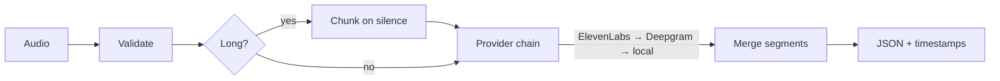

# STT Endpoint

A plug-and-play speech-to-text pipeline. It transcribes audio into text with
per-segment timestamps, API-first (**ElevenLabs → Deepgram**) with an automatic
local **faster-whisper** fallback, exposed through a FastAPI service and a
polished Streamlit demo UI.

The service runs with **no API keys** — the local model handles everything
offline. Add a key and that provider automatically joins the front of the chain.



## Quickstart

Requires [uv](https://docs.astral.sh/uv/) and `ffmpeg` on your PATH
(`winget install Gyan.FFmpeg` on Windows).

```bash
uv sync --extra dev --extra ui        # create the venv and install everything
cp .env.example .env                  # optional — add provider keys
uv run uvicorn app.main:app --reload  # API on http://localhost:8000
uv run streamlit run streamlit_app/app.py   # UI on http://localhost:8501
```

## Using the API

```bash
# health + which providers are live
curl http://localhost:8000/health
curl http://localhost:8000/v1/providers

# transcribe a file (optional language override)
curl -F "file=@your_audio.wav" -F "language=en" http://localhost:8000/v1/transcribe
```

Response:

```json
{
  "language": "en",
  "text": "hello world",
  "segments": [{ "start": 0.0, "end": 1.2, "text": "hello world" }],
  "provider": "local",
  "duration": 1.2
}
```

| Method | Path | Purpose |
|--------|------|---------|
| POST | `/v1/transcribe` | Multipart audio upload → transcript JSON. Optional `language` field. |
| GET | `/v1/providers` | Providers currently available |
| GET | `/health` | Liveness |

Errors use a consistent envelope with correct status codes: `400` invalid audio,
`422` unsupported format, `502` all providers failed.

## Configuration

Copy `.env.example` to `.env`. Everything is optional.

| Variable | Default | Meaning |
|----------|---------|---------|
| `ELEVENLABS_API_KEY` | — | Enables the ElevenLabs provider |
| `DEEPGRAM_API_KEY` | — | Enables the Deepgram provider |
| `PROVIDER_ORDER` | `elevenlabs,deepgram,local` | Fallback order; unavailable providers are skipped |
| `WHISPER_MODEL_SIZE` | `base` | Local model size (`tiny`…`large-v3`) |
| `WHISPER_COMPUTE_TYPE` | `int8` | Local compute type |
| `CHUNK_THRESHOLD_SECONDS` | `600` | Files longer than this are chunked |
| `MAX_UPLOAD_MB` | `100` | Upload size limit |

## Record your own test audio

```bash
uv sync --extra record
uv run python samples/audio_creation.py --duration 8   # saves to samples/recordings/
```

See [`samples/README.md`](samples/README.md).

## Tests

```bash
uv run pytest --cov=app --cov-report=term-missing
uv run ruff check app tests && uv run black --check app tests
```

Providers are mocked, so the suite needs no keys or network. Coverage is ~95%.

## Docker

```bash
docker build -t stt-endpoint .
docker run -p 8000:8000 --env-file .env stt-endpoint
```

## Project layout

```
app/
  main.py              FastAPI app + error handlers
  config.py            settings from .env
  schemas.py           Segment, TranscriptionResult, ErrorResponse
  errors.py            typed exceptions
  api/routes.py        endpoints
  services/
    audio.py           validate · probe · chunk · merge
    transcription_service.py   fallback orchestration
  providers/
    base.py            TranscriptionProvider ABC
    registry.py        build ordered, available chain
    elevenlabs_provider.py · deepgram_provider.py · local_whisper_provider.py
    grouping.py        words → segments
streamlit_app/app.py   demo UI
samples/               microphone recorder
tests/                 pytest suite (TDD)
docs/                  ARCHITECTURE · DESIGN_DECISIONS · CHECKLIST
```

## Design

- [`docs/ARCHITECTURE.md`](docs/ARCHITECTURE.md) — diagrams and component map
- [`docs/DESIGN_DECISIONS.md`](docs/DESIGN_DECISIONS.md) — choices + the system-design answers
- [`docs/CHECKLIST.md`](docs/CHECKLIST.md) — requirement-by-requirement mapping
