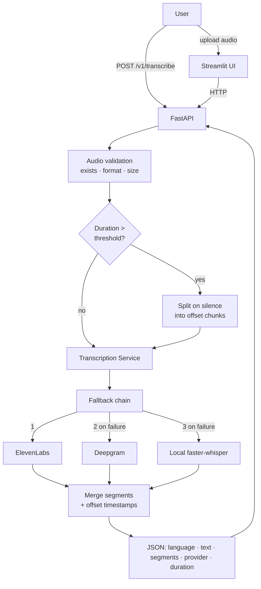
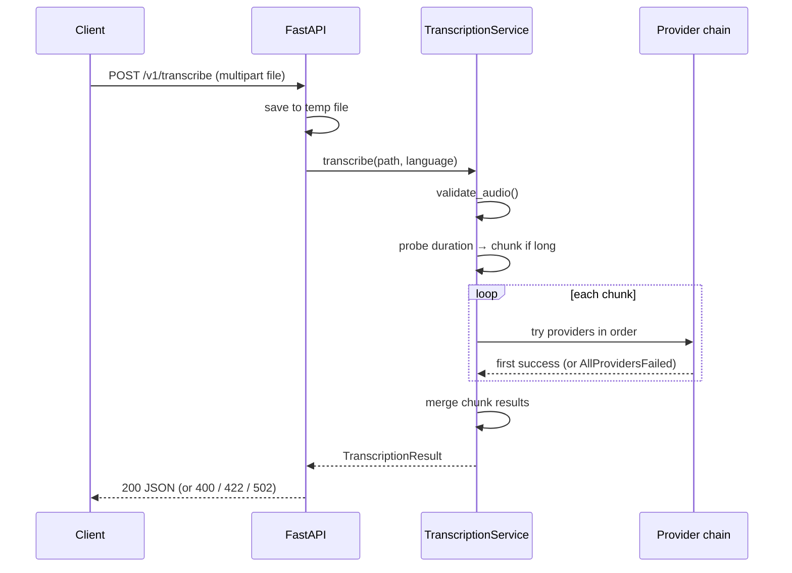

# Architecture

The service has one job: turn an audio file into text with per-segment
timestamps. Everything is organized around a small core — a provider-agnostic
transcription service — with thin front-ends (FastAPI, Streamlit) on top and
interchangeable speech-to-text backends underneath.

## Pipeline

## Request sequence

## Components

| Module | Responsibility | Key types |
|--------|----------------|-----------|
| `app/schemas.py` | Normalized wire/domain models | `Segment`, `TranscriptionResult`, `ErrorResponse` |
| `app/config.py` | Environment-driven settings | `Settings`, `get_settings()` |
| `app/errors.py` | Typed exception hierarchy | `ProviderError`, `AllProvidersFailedError`, `AudioValidationError`, `UnsupportedFormatError` |
| `app/providers/base.py` | Provider contract | `TranscriptionProvider` (ABC) |
| `app/providers/*_provider.py` | One backend each, normalizing to `TranscriptionResult` | ElevenLabs, Deepgram, local whisper |
| `app/providers/grouping.py` | Group word-level timings into segments | `group_words_into_segments()` |
| `app/providers/registry.py` | Build the ordered, availability-filtered chain | `build_providers()` |
| `app/services/audio.py` | Validation, duration probe, silence chunking, timestamp merge | `validate_audio()`, `split_on_silence()`, `merge_chunk_results()` |
| `app/services/transcription_service.py` | Orchestrate validation → chunking → fallback → merge | `TranscriptionService` |
| `app/api/routes.py` + `app/main.py` | HTTP surface + error-to-status mapping | FastAPI app |
| `streamlit_app/app.py` | Demo UI over the HTTP API | — |

## Why a provider chain

Speech-to-text is the part most likely to fail or change: an API key expires, a
vendor has an outage, or cost/accuracy trade-offs shift. Hiding each backend
behind one interface (`TranscriptionProvider`) and running them as an ordered
chain means:

- **Plug-and-play.** With no keys the chain contains only the local model, so the
  service runs offline out of the box. Add a key and that provider joins the
  chain automatically (`build_providers` filters on `is_available()`).
- **Resilience.** A provider that raises `ProviderError` is logged and skipped;
  the next one is tried. Only if *all* fail does the request return `502`.
- **Extensibility.** A new backend is one file implementing the ABC plus a line
  in the registry catalog. Nothing else changes (open/closed).

## Long audio

Cloud providers accept large files directly, but the local model benefits from
chunking, and chunking is the technique that scales. `split_on_silence` cuts on
silence boundaries (so no word is split), caps each chunk to bound memory, and
records each chunk's offset. After transcription, `merge_chunk_results` shifts
every segment's timestamps by its chunk offset and concatenates the text, so a
long file returns one continuous, correctly-timed segment list. Duration probing
is guarded — if it fails, the file is treated as short rather than erroring.

See [DESIGN_DECISIONS.md](DESIGN_DECISIONS.md) for the production scaling story
(queues, workers, storage) that this demo answers in prose.
