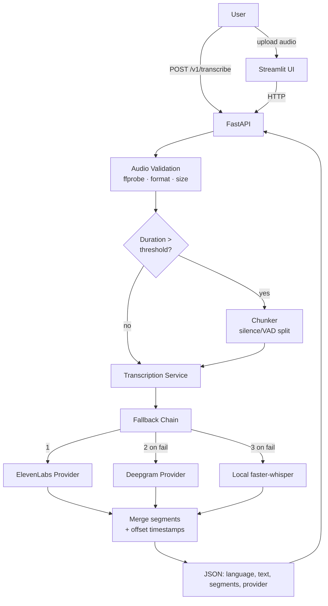

# STT Endpoint — Design Spec

**Date:** 2026-07-15
**Status:** Approved (design), pending spec review
**Scope:** Assessment deliverable — a plug-and-play speech-to-text transcription pipeline (demo-grade, not production infra).

---

## 1. Goal

Build a clean, runnable transcription pipeline that converts audio into text with per-segment
timestamps. It is **API-first** (cloud providers) with an automatic fallback to a **local model**,
exposed through a FastAPI service and a polished Streamlit demo UI. The async/queue/DB/object-storage
concerns from Part 2 of the assessment are answered as a written design, not built.

### Non-goals
- No Celery/Redis/Postgres/S3 in code. No auth server. No horizontal scaling infra.
- No model training. We orchestrate existing STT engines only.

---

## 2. Providers & fallback chain

Ordered, config-driven chain. Each link is tried in turn; on failure the service advances to the next.

1. **ElevenLabs** (primary) — Scribe STT API.
2. **Deepgram** (secondary) — Nova STT API.
3. **Local faster-whisper** (final fallback) — runs offline, no key, no data leaves the machine.

Design consequence: the service runs with **zero API keys** (local-only) and improves as keys are
added. A provider with a missing key is silently skipped, never a crash.

---

## 3. Architecture



---

## 4. Folder structure

```
stt-endpoint/
├── app/
│   ├── main.py                        # FastAPI app factory
│   ├── config.py                      # pydantic-settings: keys, provider order, thresholds
│   ├── schemas.py                     # Segment, TranscriptionResult, ErrorResponse
│   ├── api/
│   │   └── routes.py                  # POST /v1/transcribe, GET /health, GET /v1/providers
│   ├── services/
│   │   ├── transcription_service.py   # fallback orchestration
│   │   └── audio.py                   # validate, ffprobe duration, chunk-on-silence, merge
│   └── providers/
│       ├── base.py                    # TranscriptionProvider ABC + factory
│       ├── elevenlabs_provider.py
│       ├── deepgram_provider.py
│       └── local_whisper_provider.py
├── streamlit_app/
│   └── app.py                         # polished demo UI
├── tests/
│   ├── conftest.py                    # fixtures, mock providers, sample audio
│   ├── test_audio.py
│   ├── test_transcription_service.py
│   ├── test_providers.py
│   └── test_api.py
├── docs/
│   ├── ARCHITECTURE.md                # mermaid + component notes
│   ├── DESIGN_DECISIONS.md            # Part 2 written answers
│   └── CHECKLIST.md                   # quality + assessment checklist
├── samples/                           # small mock audio for demo/tests
├── .env.example
├── .gitignore
├── requirements.txt
├── Dockerfile
├── Makefile
└── README.md
```

---

## 5. Contracts

### `TranscriptionProvider` (ABC)
```
transcribe(audio_path: Path, language: str | None = None) -> TranscriptionResult
name: str
is_available() -> bool          # key present / model loadable
```
Adding a provider = one new file implementing this interface. Open/closed.

### `TranscriptionResult` (pydantic)
```
language: str
text: str
segments: list[Segment]         # Segment = {start: float, end: float, text: str}
provider: str                   # which provider actually answered
duration: float
```
One normalized schema regardless of which engine responded.

### `TranscriptionService`
Reads `PROVIDER_ORDER` from config, filters to available providers, tries each, catches provider
errors, logs the failure with context (never the key), advances. Raises `AllProvidersFailedError`
only if every provider fails.

### `audio.py`
- `validate(path)` — existence, extension whitelist, max-size → raise typed errors early.
- `probe_duration(path)` — via `ffprobe`.
- `chunk_on_silence(path, threshold)` — split long audio at silence; returns chunks with offsets.
- `merge(results, offsets)` — concatenate text, shift each segment's start/end by its chunk offset.

---

## 6. API

| Method | Path | Purpose |
|--------|------|---------|
| POST | `/v1/transcribe` | multipart audio upload → `TranscriptionResult` JSON. Optional `language` form field. |
| GET | `/health` | liveness |
| GET | `/v1/providers` | which providers are configured/available |

**Errors:** 400 missing/oversized file, 422 unsupported format, 502 all providers failed. Structured
`ErrorResponse` envelope. Versioned under `/v1`.

---

## 7. Streamlit demo UI (must be genuinely polished)

Not a bare `st.file_uploader`. Requirements:
- Clean header with title + one-line purpose; sidebar for settings (provider order override, language,
  chunk threshold), and a live "providers available" status panel.
- Drag-and-drop upload + inline audio player.
- Result view: full transcript in a readable panel, a **segment table** (start / end / text) with
  monospace timestamps, the resolved provider shown as a badge, and a **Download JSON** button.
- Loading state with spinner + elapsed time. Friendly error surface (no stack traces).
- Consistent spacing, custom theme (`.streamlit/config.toml`), no default-looking clutter.
- Calls the FastAPI endpoint over HTTP (shows the full stack working end to end), with a graceful
  message if the API is not running.

---

## 8. Code quality bar (human-grade, not "AI-written")

These are hard requirements, enforced in review:
- **Naming carries meaning.** No `data`, `result2`, `tmp`. Functions read as verbs, values as nouns.
- **Comments explain *why*, never *what*.** No line-by-line narration. No restating the code in English.
  Docstrings only where the contract isn't obvious from the signature.
- **Small, cohesive modules.** 200–400 lines typical, 800 hard max. One responsibility each.
- **No dead scaffolding** — no unused params, no speculative abstractions (YAGNI), no `# TODO` cruft.
- **Immutable-by-default** data flow; return new objects rather than mutating.
- **Explicit errors** with typed exceptions; never a bare `except:` that swallows.
- **Idiomatic Python** — type hints throughout, `pathlib`, f-strings, `httpx`/SDK clients, early returns.
- **Consistent style** — `ruff` + `black` clean. Imports ordered. No commented-out code.
- The reader should not be able to tell a machine wrote it: varied sentence rhythm in docs, natural
  structure, no repetitive templated boilerplate across files.

---

## 9. Testing (≥80% coverage target)

- Providers **mocked** — no network or keys in CI. Deterministic.
- Unit: validation paths, chunk+merge timestamp math (a 2-chunk file yields correctly offset segments),
  fallback advances on error, schema normalization per provider.
- API: FastAPI `TestClient` — happy path, bad file (400), unsupported (422), all-fail (502).
- `samples/` holds a couple of tiny audio files (mock data) for local demo and integration-style tests.

---

## 10. Part 2 — written design answers (`docs/DESIGN_DECISIONS.md`)

Concise, engineering-manager-level answers, consistent with the built code:
- **Concurrent uploads:** offload transcription out of the request; queue + worker pool; API returns
  `202 + job_id`. (Design; the demo shows the sync path + in-code chunking.)
- **Storage:** audio in object storage (S3/GCS/Azure Blob); transcripts + metadata + job status in
  Postgres; segments as JSONB.
- **Retry/recovery:** job status machine (queued/processing/completed/failed), bounded retries with
  exponential backoff, keep original audio for manual replay.
- **API exposure:** FastAPI, `POST` upload → `202`, `GET /jobs/{id}` status/result, auth, rate limiting,
  file validation, `/v1` versioning.

Each answer explicitly connects to what the demo already demonstrates (provider abstraction, fallback,
chunking, validation).

---

## 11. Deliverables

- Runnable pipeline: importable service **and** FastAPI endpoint, per-segment timestamps.
- Format handling + long-file chunking in code.
- API-first with local fallback.
- Polished Streamlit UI.
- `README.md` (design decisions summary + run instructions for API, UI, tests, Docker).
- `docs/ARCHITECTURE.md`, `docs/DESIGN_DECISIONS.md`, `docs/CHECKLIST.md`.
- Git repo, conventional commits. GitHub push confirmed with user during implementation.
```
